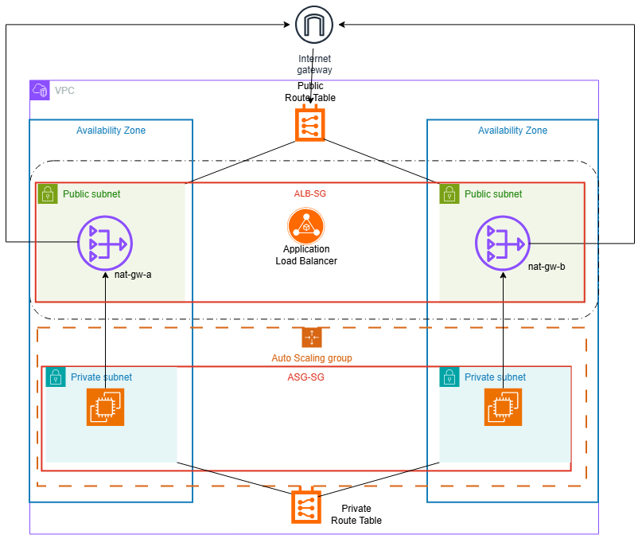

# Terraform-vpc-ec2-alb-asg
This project mimics a production-style AWS environment utilizing Terraform.
It includes a VPC, public/private subnets,EC2 launce template, Application Load Balancer, and Auto Scaling Group.
The goal is to demonstrate real cloud engineering skills using infrastructure as code.

# 📘 Table of Contents
* [Overview](#overview)
* [Architecture Diagram](#architecture-diagram)
* [Architecture Summary](#architecture-summary)
* [Services Used](#services-used)
* [Folder Structure](#folder-structure)
* [Deployment](#deployment)
* [IAM Least Privilege](#iam-least-privilege)
* [Tradeoff Analysis](#tradeoff-analysis)
* [Cost Breakdown](#cost-breakdown)
* [Failure Scenario & Recovery Playbook](#failure-scenario--recovery-playbook)
* [Lessons Learned](#lessons-learned)
* [Screenshots](#screenshots)

# Architecture Diagram

# Architecture Summary 
* VPC with public + private subnets
* Internet Gateway and NAT Gateway for connectivity
* Route Tables for public and private routing
* Security Groups for inbound/outbound control
* Application Load Balancer to distribute traffic
* Auto Scaling Group to scale EC2 instances
* IAM Role for SSM access
* EC2 Launch Template defining instance configuration

# Services Used
* VPC
* Subnets( Public and Private)
* Internet Gateway(IGW)
* Nat Gateway
* Route Tables
* Security Groups
* EC2
* Application Load Balancer(ALB)
* Auto Scaling Group(ASG)
* IAM Role(SSM Access)
  
  
##  Folder Structure
TFP1/
├── .terraform/                    
├── .terraform.lock.hcl        
├── main.tf                         
├── modules.tf                     
├── outputs.tf                      
├── providers.tf                   
├── terraform.tfstate          
├── terraform.tfstate.1785875736.backup  
├── terraform.tfstate.backup        
├── variables.tf                    

   # Deployment
* terraform init
* terraform plan
* terraform apply

  # IAM Least Privilege
  * EC2 role with minimal permissions
 
  * SSM Role 
 
  * No wildcard policies
 
  * Resource-scoped policies
 
   # Failure Scenario and Recovery Playbook
  ### Scenario : ALB health checks fail
  ### Root Cause: Incorrect security group or user data
  ###  Recovery Steps:
  1. Validate SG inbound rules
  2. Check EC2 user data logs
  3. Restart instance or redeploy
  4. Confirm ALB target health
  ### Prevention:
  * Add automated validation
  * Add Cloudwatch alarms
 ##  Tradeoff Analysis
This section explains the architectural decisions and their tradeoffs.

* **EC2 vs Lambda:** EC2 chosen for persistent compute and predictable cost; Lambda offers serverless simplicity but higher per‑invocation pricing.  
 * **ALB vs NLB:** ALB supports HTTP routing and health checks; NLB provides lower latency but lacks path‑based routing.  
*  **NAT Gateway vs VPC Endpoints:** NAT Gateway enables outbound internet access for private subnets; endpoints are cheaper for internal AWS traffic only.  
  * **t2.micro vs t2.nano:** t2.micro selected for better baseline performance and demo stability; t2.nano is cheaper but limited for multi‑instance scaling.

# Cost Breakdown 
| Component | Cost | Notes |
| --- | --- | --- |
| EC2 t4g.nano | ~$3/mo | cheapest option |
| ALB | ~$16/mo | delete when not testing |
| VPC | $0 | free |
| Endpoints | $0 | free |
# Business Impact
* Cost-efficent scaling
  
* Reduced downtime risk

* Improved reliability

* Lower operational overhead

* Strong security posture

 # Lessons Learned

  * Importance of modular Terraform
 
  * Value of IAM  least privilege
 
  * How ALB  health checks behave
 
  * How to optimize cloud cost
 
  # Screenshots
  ### VPC and Subnets
  This screenshot shows the AWS VPC Dashboard with all core networking resources created
 
  This screenshot shows the public and private subnets for A and B
  
  
  ### Route Table for IGW
   Public route table for the internet gateway
  
  ### Route Table for NAT Gateway
  Private route table for the NAT gateway
  
  ### Internet Gateway
  Internet gateway connected to the VPC.
  
  Internet gateway details. 
 
 ### NAT Gateway
  NAT Gateway details.
 
 ### Security Groups
The security group details for the Auto Load Balancer(ALB)
 
 
 The inbound rules for the Auto Load Balancer(ALB)
 
 
 The outbound rules for the Auto Load Balancers(ALB)
 
 
 Security group details for the instance 
 
 
 Instance inbound rules
 
 
Instance outbound rules

### Launch Template
Launch template details

### IAM EC2 SSM Role
SSM role details

SSM role permissions

SSM JSON block

### Auto Scaling Group

Auto Scaling Group(ASG) capacity configuration 

Auto Scaling Group(ASG) overview

Auto Scaling Group(ASG) CPU metric 

### Instance
Instance summary

Second instance summary

### Auto Load Balancer
Auto load balancer details

Listener and rules

Target groups details with health checks 

Validation ALB DNS test

CloudShell validation test 

### Failure and Recovery
Stopping instance

Target group marks instance as unhealthy

ASG replaces unhealthy instance with a healthy one 

 

 

 
 

 
 

 

  

 
 
 
 

